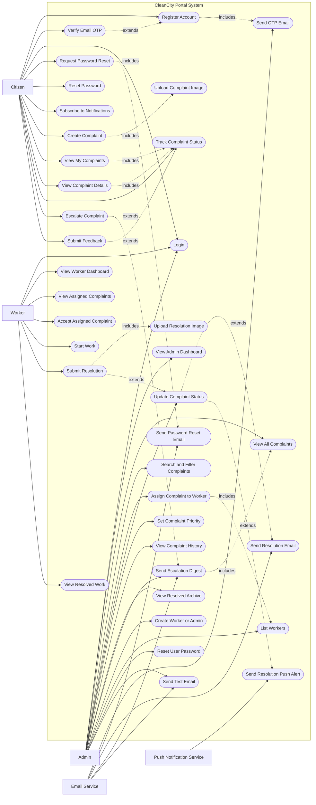

# CleanCity Portal Use Case Diagram

This document contains Mermaid.js code for the CleanCity Portal use case diagram.
Actors are placed outside the system boundary, and all portal use cases are shown inside the box.

## Mermaid.js Diagram



## Relationship Summary

| Actor | Main Use Cases |
| --- | --- |
| Citizen | Register, verify OTP, login, reset password, create complaints with images, view complaints, track status, escalate unresolved complaints, submit feedback, subscribe to notifications |
| Admin | View dashboard, view/search/filter complaints, assign workers, update status, set priority, view history, view resolved archive, send escalation digest, create staff, list workers, reset user passwords, test email |
| Worker | View dashboard, view assigned complaints, accept complaint, start work, submit resolution with image, view resolved work |
| Email Service | Sends OTP, password reset, complaint resolution, escalation digest, and test emails |
| Push Notification Service | Sends complaint resolution push alerts |

## Prompt for ChatGPT

Use this prompt if you want ChatGPT to recreate or improve the use case diagram:

```text
Create a UML use case diagram for my project named "CleanCity Portal". The system is a smart civic cleanliness complaint portal. Place all actors outside the system boundary box and all use cases inside the box. Show clear relationships between actors and use cases.

Actors:
- Citizen
- Admin
- Worker
- Email Service
- Push Notification Service

Citizen use cases:
- Register Account
- Verify Email OTP
- Login
- Request Password Reset
- Reset Password
- Subscribe to Notifications
- Create Complaint
- Upload Complaint Image
- View My Complaints
- View Complaint Details
- Track Complaint Status
- Escalate Complaint
- Submit Feedback

Admin use cases:
- View Admin Dashboard
- View All Complaints
- Search and Filter Complaints
- Assign Complaint to Worker
- Update Complaint Status
- Set Complaint Priority
- View Complaint History
- View Resolved Archive
- Send Escalation Digest
- Create Worker or Admin
- List Workers
- Reset User Password
- Send Test Email

Worker use cases:
- View Worker Dashboard
- View Assigned Complaints
- Accept Assigned Complaint
- Start Work
- Submit Resolution
- Upload Resolution Image
- View Resolved Work

External service use cases:
- Email Service sends OTP email, password reset email, resolution email, escalation digest, and test email.
- Push Notification Service sends resolution push alerts.

Generate Mermaid.js code in Markdown. Use a system boundary named "CleanCity Portal System". Keep actors outside the box and use cases inside it. Use include or extend style relations where useful, such as Create Complaint includes Upload Complaint Image, Register Account includes Send OTP Email, Request Password Reset includes Send Password Reset Email, Submit Resolution includes Upload Resolution Image, and Update Complaint Status extends Send Resolution Email and Send Resolution Push Alert.
```
